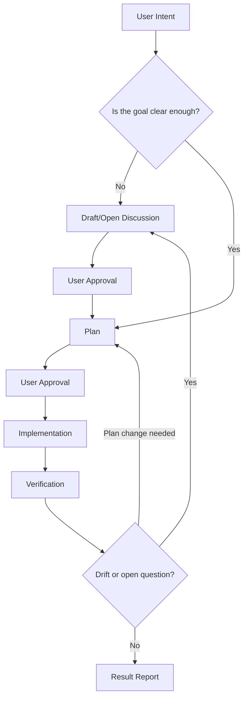

# Discussion: 실행 권한 계층과 README 워크플로우 표현

## Status (상태)

closed

## Summary (요약)

이 논의는 `.project-context/`를 계획 이후 일반 구현 작업의 상시 참조 대상이 아니라, 맥락 수집과 근거 보관 공간으로 제한하는 규칙을 정리합니다.

또한 루트 `README.md`에 현재 문장으로 설명된 `논의 -> 승인 -> 계획서 -> 승인 -> 구현` 흐름을 루프가 있는 Mermaid 다이어그램으로 표현할지 검토합니다.

최종 결론은 `.project-context/`의 참조 권한을 작업 단계별로 나누고, README에는 Intent-Anchored Development의 반복 흐름을 Mermaid로 추가하는 것입니다.

## Background (배경)

사용자는 `.project-context/`가 계획서 이후 일반 작업에서 계속 참조해야 하는 구조가 되는 것을 원하지 않습니다. 목표는 논의, 조사, 보고서, 세션 체크포인트, 입력 자료를 `.project-context/`에 모으되, 계획이 승인된 이후의 실행 기준은 `PROJECT.md`, `AGENTS.md`, `docs/contracts/`, `docs/architectures/`, `docs/plans/`로 승격하는 것입니다.

추가로 사용자는 계획서 작성 중에도 `.project-context/` 전체를 자유롭게 참조하기보다, 기본 참조 대상을 논의 문서의 `draft`와 `open` 정도로 제한하는 방식을 제안했습니다. 그 외 `.project-context/reports/`, `.project-context/assets/`, `.project-context/discussions/closed/` 등은 사용자가 명시하거나, 에이전트가 참조 필요성을 요청하고 승인받은 뒤 참조하는 방향을 검토합니다. 단, 최신 세션 파일 1개는 장기 작업 시작 시 기본 참조 대상으로 유지합니다.

루트 `README.md`에는 하네스 컨셉과 사용 규칙이 추가됐지만, `논의 -> 승인 -> 계획서 -> 승인 -> 구현 -> 검증`의 반복 흐름은 아직 도식화되어 있지 않습니다.

## Context (맥락)

현재 공식 문서 위치와 작업 맥락 위치는 다음과 같이 나뉩니다.

- `PROJECT.md`: 프로젝트 목표, 범위, 환경, 스택, 철학, 제약, 품질 기준, 열린 질문
- `AGENTS.md`: 에이전트 행동 규칙, 문서 구조, 계약 경계, 검증, 도구 선택
- `docs/contracts/`: 공식 계약 경계 문서
- `docs/architectures/`: 공식 아키텍처 문서
- `docs/plans/`: 공식 계획 문서
- `.project-context/discussions/`: 결정 전 논의와 흡수 완료된 논의 이력
- `.project-context/reports/`: 분석 보고서, 검토 결과, 도입 전략
- `.project-context/sessions/`: 세션 체크포인트와 인계 메모
- `.project-context/inbox/`: 사용자 제공 임시 입력 자료
- `.project-context/assets/`: 보존 가치가 있는 참조 자료

현재 `AGENTS.md`는 닫힌 논의의 결론을 공식 문서로 흡수한다고 설명하지만, 작업 단계별로 `.project-context/`의 기본 참조 허용 범위를 명확히 구분하지는 않습니다.

## Scope (범위)

포함:

- 계획 작성 전, 계획 작성 중, 계획 승인 후 구현 단계의 참조 권한 계층 정의
- `.project-context/` 하위 디렉토리별 기본 참조 가능 여부 정의
- 사용자가 명시하거나 에이전트가 요청/승인받은 뒤 참조하는 예외 흐름 정의
- 루트 `README.md`에 Mermaid workflow를 추가할지 검토
- 확정 시 반영 대상 문서 후보 정리

제외:

- 지금 즉시 README 또는 AGENTS를 수정하는 작업
- 실제 Mermaid 다이어그램 최종 문구 확정
- 자동 권한 시스템 또는 도구 레벨 접근 제어 구현
- 기존 보고서와 닫힌 논의의 대규모 정리
- 다국어 README 작성

## Constraints (제약)

- `.project-context/`가 비공식 실행 기준 저장소가 되면 안 됩니다.
- 계획 승인 후 일반 구현 작업의 기준은 `docs/plans/`, `docs/contracts/`, `docs/architectures/`, `PROJECT.md`, `AGENTS.md`여야 합니다.
- 참조 제한이 너무 강하면 에이전트가 필요한 근거를 찾지 못해 질문만 늘어날 수 있습니다.
- 참조 제한은 실제 파일 권한 강제가 아니라 작업 규칙과 하네스 행동 지침에 가깝습니다.
- 사용자가 명시한 자료는 단계와 관계없이 우선 참조할 수 있어야 합니다.

## Analysis (분석)

`.project-context/`를 계속 열어보는 구조는 장기적으로 document drift와 intent drift를 키울 수 있습니다. 보고서, 닫힌 논의, 과거 세션은 중요한 근거이지만, 계획이 승인된 뒤에도 계속 실행 기준처럼 참조되면 공식 문서와 중간 산출물의 책임이 섞입니다.

반대로 `.project-context/`를 너무 엄격하게 막으면 계획 작성 중에 필요한 배경과 대안을 놓칠 수 있습니다. 특히 `draft`와 `open` 논의는 아직 공식 문서로 흡수되지 않은 질문, 대안, 트레이드오프를 담기 때문에 계획 작성 중 기본 참조 대상으로 보는 것이 자연스럽습니다.

따라서 단계별로 기본 참조 범위를 다르게 두는 것이 적절합니다.

- 계획 전 논의 단계: `.project-context/discussions/draft`, `.project-context/discussions/open`, 사용자가 제공한 입력 자료를 기본 참조할 수 있습니다.
- 계획 작성 단계: `PROJECT.md`, `AGENTS.md`, `docs/`와 함께 `.project-context/discussions/draft`, `.project-context/discussions/open`을 기본 참조할 수 있습니다.
- 계획 승인 후 구현 단계: 승인된 `docs/plans/`와 공식 문서를 기준으로 하고, `.project-context/`는 기본 참조하지 않습니다.
- 예외: 사용자가 명시하거나 에이전트가 이유를 제시해 승인받은 경우 `.project-context/reports/`, `.project-context/assets/`, `.project-context/discussions/closed/`를 참조합니다. 최신 세션 파일 1개는 장기 작업 시작 시 기본 참조하되, 실행 기준이 아니라 인계 체크포인트로만 사용합니다.

루트 README의 workflow는 문장만으로 설명하면 단계와 루프가 한눈에 보이지 않습니다. Mermaid 다이어그램을 쓰면 다음 흐름을 더 명확히 표현할 수 있습니다.

- 사용자의 의도 입력
- 필요한 경우 논의 문서 작성
- 사용자 승인
- 계획서 작성
- 사용자 승인
- 구현
- 검증
- 결과 보고
- 드리프트 또는 열린 질문 발견 시 논의 또는 계획으로 되돌아감

## Options (대안)

옵션 A: `.project-context/` 전체를 언제든 참조 가능하게 둡니다.

- 장점: 에이전트가 필요한 배경을 빠르게 찾을 수 있습니다.
- 단점: 계획 이후에도 중간 산출물이 실행 기준처럼 작동할 수 있습니다.
- 단점: 오래된 보고서나 닫힌 논의가 최신 공식 문서보다 우선되는 혼란이 생길 수 있습니다.

옵션 B: 계획 작성 중에는 `draft/open` 논의만 기본 참조하고, 나머지 `.project-context/`는 명시 또는 승인 후 참조합니다.

- 장점: 계획 작성에 필요한 미확정 맥락은 유지하면서 실행 기준의 오염을 줄입니다.
- 장점: 보고서, 세션, assets, 닫힌 논의를 근거 자료로 낮출 수 있습니다.
- 단점: 에이전트가 보고서에 있는 중요한 근거를 바로 보지 못할 수 있습니다.
- 단점: 참조 요청과 승인 절차가 추가됩니다.

옵션 C: 계획 승인 후에는 `.project-context/`를 기본 참조하지 않고, 계획서와 공식 문서만 참조합니다.

- 장점: 실행 기준이 매우 명확합니다.
- 장점: 계획서가 필요한 내용을 충분히 흡수하도록 압박합니다.
- 단점: 계획서가 불완전하면 작업 중 필요한 배경을 다시 물어봐야 합니다.

옵션 D: 루트 README workflow를 텍스트로 유지합니다.

- 장점: README가 단순합니다.
- 단점: 루프와 예외 흐름이 한눈에 보이지 않습니다.

옵션 E: 루트 README workflow를 Mermaid 다이어그램으로 추가합니다.

- 장점: 논의, 승인, 계획, 구현, 검증, 되돌아가는 루프를 한눈에 보여줄 수 있습니다.
- 장점: Intent-Anchored Development의 작업 리듬을 설명하기 좋습니다.
- 단점: Mermaid를 지원하지 않는 렌더러에서는 가독성이 떨어질 수 있습니다.

## Trade-offs (트레이드오프)

참조 권한을 넓게 열수록 에이전트는 더 많은 배경을 자동으로 찾을 수 있지만, 공식 기준과 과거 맥락이 섞일 위험이 커집니다. 참조 권한을 좁힐수록 실행 기준은 명확해지지만, 에이전트가 필요한 배경을 찾기 위해 사용자에게 더 자주 물어볼 수 있습니다.

이 하네스의 목표가 바이브 코딩보다 의도 정렬, 계약 경계, 장기 맥락 유지에 있다면, 실행 단계에서는 공식 문서 중심으로 좁히는 편이 맞습니다. 다만 계획 작성 단계에서는 아직 공식화되지 않은 논의가 필요하므로 `draft/open` 논의까지는 기본 참조 대상으로 두는 것이 균형점입니다.

Mermaid 다이어그램은 README를 조금 더 복잡하게 만들지만, 하네스의 루프 구조를 보여주는 데 적합합니다. 특히 드리프트 발견 시 논의 또는 계획으로 되돌아가는 흐름은 텍스트보다 다이어그램이 더 명확합니다.

## Recommended Strategy / Plan / Options (추천 전략/계획/옵션)

추천안은 옵션 B, C, E를 조합하는 것입니다.

참조 권한 계층:

- 논의 단계: `.project-context/discussions/draft`, `.project-context/discussions/open`, 사용자가 명시한 입력 자료를 기본 참조합니다.
- 계획 작성 단계: `PROJECT.md`, `AGENTS.md`, `docs/`와 함께 `.project-context/discussions/draft`, `.project-context/discussions/open`을 기본 참조합니다.
- 계획 승인 후 구현 단계: `PROJECT.md`, `AGENTS.md`, `docs/contracts/`, `docs/architectures/`, 승인된 `docs/plans/`를 기준으로 작업합니다.
- 계획 승인 후 구현 단계에서는 `.project-context/`를 기본 참조하지 않습니다.
- `.project-context/reports/`, `.project-context/sessions/`, `.project-context/assets/`, `.project-context/discussions/closed/`는 사용자가 명시하거나, 에이전트가 참조 이유를 제시하고 승인받은 경우에만 참조합니다.
- `.project-context/inbox/`는 사용자가 특정 입력 파일을 명시했거나, 해당 작업의 입력으로 제공된 경우에만 참조합니다.

README Mermaid 방향:

확정 시 반영 후보:

- `README.md`: Mermaid workflow와 실행 권한 계층 요약
- `AGENTS.md`: 단계별 `.project-context/` 참조 규칙
- `.project-context/README.md`: `.project-context/`는 실행 권한이 아니라 맥락/근거 보관소라는 원칙
- `.project-context/discussions/README.md`: `draft/open/closed` 논의의 참조 의미 보강
- `docs/plans/README.md`: 계획서가 계획 승인 후 실행 기준을 충분히 흡수해야 한다는 원칙

## Decision Candidate (결정 후보)

아직 확정 전이지만 현재 결정 후보는 다음과 같습니다.

- `.project-context/`는 실행 권한을 갖는 공식 기준이 아니라 맥락 수집과 근거 보관 공간으로 정의합니다.
- 계획 작성 중 기본 참조 가능한 `.project-context/` 범위는 `.project-context/discussions/draft`와 `.project-context/discussions/open`으로 제한합니다.
- `.project-context/reports`, `.project-context/assets`, `.project-context/discussions/closed`는 사용자 명시 또는 에이전트의 참조 요청과 사용자 승인 후 참조합니다.
- `.project-context/sessions`의 최신 세션 파일 1개는 장기 작업 시작 시 기본 참조합니다. 단, 세션은 실행 기준이 아니라 인계 체크포인트입니다.
- 계획 승인 후 구현 단계에서는 `.project-context/`를 기본 참조하지 않고, 승인된 계획서와 공식 문서를 기준으로 작업합니다.
- 루트 `README.md`에는 `논의 -> 승인 -> 계획서 -> 승인 -> 구현 -> 검증` 흐름과 되돌아가는 루프를 Mermaid로 추가합니다.
- `.project-context/reports/`는 특정 시점의 관찰과 근거이며 실행 기준이 아니므로 기본 참조 대상에서 제외합니다.
- 세션 체크포인트는 context drift를 줄이기 위해 강화하고, 최신 세션 파일 1개는 장기 작업 시작 시 기본 참조합니다.

## Questions (질문)

- 계획 작성 중 기본 참조 가능한 논의 범위를 `draft/open` 둘 다로 둘까요, 아니면 `open`만 기본 참조하고 `draft`는 승인 후 참조하게 할까요?
  답변: `draft/open` 둘 다 기본 참조합니다.
- `.project-context/reports/` 중 bootstrap/설치 가이드처럼 운영상 자주 필요한 문서는 예외적으로 기본 참조 가능하게 둘까요?
  답변: 아니요. 보고서는 특정 시점만 반영하므로 기본 참조하지 않도록 문서화하고, 사용자에게 그 의도를 전달합니다.
- `.project-context/sessions/`의 최신 1개 세션 파일은 장기 작업 시작 시 기본 참조로 유지할까요, 아니면 계획 승인 후에는 승인 요청 후 참조하게 바꿀까요?
  답변: 최신 세션 파일 1개는 기본 참조합니다. 대신 세션 업데이트 규칙을 강화합니다.
- README Mermaid는 `Concept` 근처에 둘까요, 아니면 `Usage Rules` 앞에 별도 `Workflow` 섹션으로 둘까요?
  답변: 작업자가 적절한 위치를 선택합니다.
- Mermaid 다이어그램은 한국어 노드로 둘까요, 영어 노드로 둘까요? 향후 영어/일본어/중국어 README 계획을 고려하면 영어 노드가 나을 수 있습니다.
  답변: 영어 노드를 사용합니다.

## Open Issues (열린 쟁점)

- `AGENTS.md`의 현재 지침은 새 세션이나 장기 작업 시작 시 최신 세션 파일 1개를 먼저 확인한다고 되어 있습니다. 이 규칙은 유지하되, 세션은 실행 기준이 아니라 인계 체크포인트라는 점을 명시해야 합니다.
- `.project-context/reports/003-bootstrap-installation-guide.md`처럼 README에서 직접 안내하는 보고서는 기본 참조 대상에서 제외해야 합니다. 계속 필요한 운영 기준은 공식 문서로 승격해야 합니다.
- 실제 도구 권한으로 제한할 수 없으므로, 규칙 위반을 어떻게 감지하고 보고할지 정해야 합니다.

## Resolution (정리 결과)

사용자 승인에 따라 다음 결론으로 확정합니다.

- 계획 작성 중 기본 참조 가능한 논의 범위는 `.project-context/discussions/draft`와 `.project-context/discussions/open`입니다.
- `.project-context/reports/`는 특정 시점의 관찰과 근거이며 실행 기준이 아니므로 기본 참조하지 않습니다.
- `.project-context/sessions/`의 최신 세션 파일 1개는 장기 작업 시작 시 기본 참조합니다.
- 세션 체크포인트 업데이트 규칙을 강화합니다.
- 루트 `README.md`의 workflow는 영어 노드 Mermaid 다이어그램으로 추가합니다.

이 결론은 다음 계획서로 흡수합니다.

- `docs/plans/scheduled/2026-06-13_14-09-50_execution-authority-workflow.md`

## Absorption Target (흡수 대상)

다음 계획서로 흡수합니다.

- `docs/plans/scheduled/2026-06-13_14-09-50_execution-authority-workflow.md`

계획 실행 후 다음 문서에 반영합니다.

- `README.md`
- `AGENTS.md`
- `.project-context/README.md`
- `.project-context/discussions/README.md`
- `.project-context/reports/README.md`
- `.project-context/sessions/README.md`
- `docs/plans/README.md`

## References (근거 및 영향 문서)

근거:

- 사용자 요청: `.project-context/`를 계획 이후 일반 구현 작업의 상시 참조 대상으로 두지 않는 구조 검토
- 사용자 요청: 계획서 작성 중 기본 참조 범위를 `.project-context/discussions/draft`와 `.project-context/discussions/open` 정도로 제한하는 방안
- 사용자 요청: 루트 README의 논의/승인/계획/구현 흐름을 Mermaid 루프로 표현하는 방안
- `README.md`
- `AGENTS.md`
- `.project-context/README.md`
- `.project-context/discussions/README.md`
- `docs/README.md`
- `docs/plans/README.md`

영향:

- `README.md`
- `AGENTS.md`
- `.project-context/README.md`
- `.project-context/discussions/README.md`
- `.project-context/reports/README.md`
- `.project-context/sessions/README.md`
- `docs/plans/README.md`
