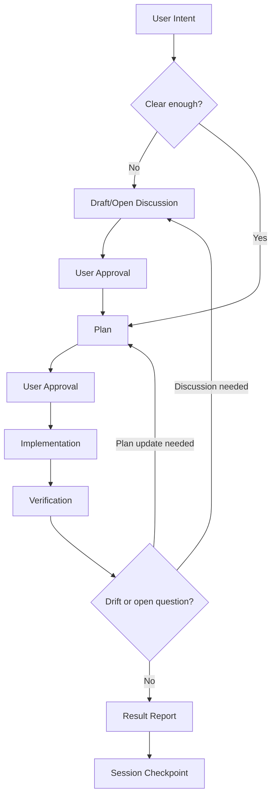

# opencode Thin Agent Harness Template

ppp0ppp의 Intent-Anchored Development용 opencode 얇은 에이전트 하네스 템플릿입니다.

## Concept

이 템플릿은 Intent-Anchored Development를 위한 opencode thin agent harness입니다.

1차 목표는 다양한 provider와 중상급 LLM을 교체해도 에이전트가 사용자 의도, 제약, 작업 방식, 원하는 산출물 형상을 안정적으로 따르도록 만드는 것입니다.

2차 목표는 사용자가 원하는 형상을 문서, 계약, 계획, 세션 기록으로 구체화하여 사용자, 팀, LLM이 서로 다르게 상상하는 간극을 줄이는 것입니다.

이 하네스는 자체 에이전트 런타임이나 무거운 오케스트레이션 프레임워크가 아닙니다. 대신 `PROJECT.md`, `AGENTS.md`, `docs/contracts/`, `docs/architectures/`, `docs/plans/`, `.project-context/` 같은 얇은 문서 레이어를 사용합니다.

핵심 아이디어는 에이전트가 매번 즉흥적으로 판단하지 않도록 사용자 의도, 요구사항, 계약 경계, 논의 과정, 실행 계획, 세션 상태를 명시적인 기준점으로 남기는 것입니다. 에이전트는 그 기준에서 벗어나는 변경을 발견하면 추측하지 않고 멈춰서 확인합니다.

## Workflow

작업 흐름은 고정된 일방향 절차가 아니라 드리프트와 열린 질문을 발견하면 논의나 계획으로 되돌아가는 루프입니다.

## Execution Authority

계획 승인 후 일반 구현 작업의 실행 기준은 `PROJECT.md`, `AGENTS.md`, `docs/contracts/`, `docs/architectures/`, 승인된 `docs/plans/`입니다.

`.project-context/`는 실행 기준이 아니라 맥락 수집과 근거 보관을 위한 공간입니다. 계획 작성 중에는 `.project-context/discussions/draft`와 `.project-context/discussions/open`을 기본 참조할 수 있지만, 계획 승인 후 구현 단계에서는 기본 참조하지 않습니다.

`.project-context/reports/`는 특정 시점의 관찰과 근거입니다. 보고서는 현재 실행 기준이 아니므로 사용자가 명시하거나 에이전트가 이유를 제시해 승인받은 경우에만 참조합니다.

장기 작업을 시작할 때는 `.project-context/sessions/`의 최신 세션 파일 1개를 기본 참조할 수 있습니다. 단, 세션은 공식 요구사항이나 계획을 대체하지 않는 인계 체크포인트입니다.

## Web Access

논의와 계획 단계에서 최신 외부 정보, 공식 스키마, 설정 필드, 설치 방법, provider 문서가 필요한 경우 추측하지 말고 웹 확인을 우선합니다.

- URL이 명확하면 `webfetch`로 공식 문서를 확인합니다.
- 검색 도구가 제공되는 환경이면 `websearch`로 공식 출처를 찾은 뒤, 최종 확인은 공식 문서를 `webfetch`로 수행합니다.
- 검색 도구가 없는 환경에서는 사용자에게 URL을 요청하거나 알려진 공식 URL을 `webfetch`로 확인합니다.
- 민감한 코드, 토큰, 개인정보, 내부 URL은 웹 요청이나 검색 질의에 포함하지 않습니다.
- 비공식 출처는 사용자 승인 후 참고하거나, 공식 출처가 아님을 별도로 표시합니다.
- 계획서에서 웹 접근을 사용했다면 `References`에 URL, 공식/비공식 여부, 확인 목적을 짧게 기록합니다.
- 웹 접근이 실패하거나 권한/도구가 없으면 그 사실을 보고하고 로컬 공식 문서 기준으로 판단합니다.

## Thin Harness

이 프로젝트를 thin harness로 보는 이유는 모델 실행 엔진이나 복잡한 planner를 새로 만들지 않기 때문입니다. 특정 provider, 특정 LLM, 특정 multi-agent 프레임워크에 깊게 묶이지 않고, opencode 위에 문서, 설정, skill, agent prompt, 디렉토리 규칙을 얇게 얹습니다.

이 하네스의 역할은 모델을 더 똑똑하게 만드는 것이 아니라, 모델이 바뀌어도 작업 습관과 판단 경계를 덜 흔들리게 만드는 것입니다.

## Drift Risks

이 하네스는 다음 드리프트를 주요 리스크로 봅니다.

- intent drift: 사용자 의도와 실제 결과물의 차이
- shape drift: 사용자가 상상한 산출물 형상과 LLM이 만든 형상의 차이
- document drift: 문서와 실제 코드/상태의 차이
- contract drift: 합의된 계약 경계와 구현의 차이
- context drift: 세션이 바뀌며 작업 맥락이 사라지는 문제

## Not For Vibe Coding

이 템플릿은 바이브 코딩을 위한 설정 모음이 아닙니다.

빠르게 아이디어를 던지고, LLM이 즉흥적으로 구현한 결과를 보며 감각적으로 방향을 잡는 용도라면 이 하네스는 과하게 느껴질 수 있습니다.

이 템플릿은 속도보다 의도 정렬, 계약 경계, 작업 재현성, 장기 맥락 유지가 더 중요한 상황을 위해 설계되었습니다.

## Strengths

- 장기 작업에서 맥락 손실을 줄입니다.
- provider와 LLM을 교체해도 기본 작업 방식이 덜 흔들립니다.
- 사용자, 팀, LLM 사이의 산출물 형상 차이를 줄입니다.
- 계약 경계 변경을 명시적으로 드러냅니다.
- 에이전트가 임의로 큰 설계 판단을 하지 않도록 제한합니다.
- 논의, 계획, 구현, 검증, 세션 인계를 분리해 작업 추적성이 좋아집니다.
- 개인 프로젝트와 팀 프로젝트 모두에서 opencode 기본 행동을 일관되게 만들 수 있습니다.

## Weaknesses

- 작은 작업에는 문서화 비용이 과하게 느껴질 수 있습니다.
- 문서를 갱신하지 않으면 오래된 문서가 잘못된 기준점이 됩니다.
- 에이전트가 더 보수적으로 행동하므로 즉흥적인 프로토타이핑 속도는 느려질 수 있습니다.
- 계약 경계와 승인 기준을 사용자가 명확히 적지 않으면 효과가 떨어집니다.
- 낮은 성능의 모델을 좋은 엔지니어처럼 만들어 주지는 못합니다.

## Constraints

- `PROJECT.md`는 프로젝트 목표, 환경, 스택, 제약, 품질 기준의 기준 문서로 유지합니다.
- 계약 경계는 `docs/contracts/` 또는 `PROJECT.md`에 명시합니다.
- 큰 설계 변경이나 뒤집힐 수 있는 판단은 `.project-context/discussions/`에서 먼저 다룹니다.
- 승인된 실행 계획은 `docs/plans/`에 남깁니다.
- 세션 인계가 필요한 작업은 `.project-context/sessions/`에 짧게 체크포인트를 남깁니다.
- 이 하네스는 사용자의 판단을 대체하지 않고, 사용자가 판단해야 할 지점을 드러내는 장치로 사용합니다.

## User Responsibility

이 템플릿은 사용자가 전문 아키텍트일 것을 요구하지 않습니다. 다만 사용자는 목표, 제약, 성공 기준, 바꾸면 안 되는 경계를 말로 고정하려는 태도를 가져야 합니다.

사용자는 모든 기술 결정을 직접 설계할 필요는 없습니다. LLM이 후보를 제안하고, 사용자는 그 후보가 원하는 방향인지 승인하거나 거절할 수 있으면 됩니다.

사용자가 최소한으로 제공해야 하는 기준은 다음과 같습니다.

- 무엇을 만들고 싶은지
- 이번 작업의 성공 기준이 무엇인지
- 절대 바꾸면 안 되는 것이 무엇인지
- 바꿔도 되는 것이 무엇인지
- 비용, 보안, 성능, 일정 중 무엇을 우선할지
- API, DB, 인증, 배포, 데이터처럼 위험한 경계가 어디인지
- 결과물이 어떤 모양이면 맞다고 볼 수 있는지

사용자가 아무 기준도 주지 않으면 이 하네스는 에이전트를 강하게 만들지 못하고, 단지 질문을 더 잘하게 만들 뿐입니다.

## Usage Rules

- 문서가 현실과 달라지면 코드보다 먼저 기준 문서를 갱신하거나, 최소한 드리프트를 기록합니다.
- 계약 경계를 바꾸는 작업은 사용자 승인 없이 진행하지 않습니다.
- 에이전트가 추측해야 하는 항목은 `PROJECT.md`의 Open Questions에 남깁니다.
- 임시 입력 파일은 `.project-context/inbox/`에 두고, 장기 보존 자료는 민감정보 제거 후 `.project-context/assets/`로 승격합니다.
- 계획 이후 실행에 필요한 내용은 `.project-context/`에 남겨두지 말고 `PROJECT.md`, `AGENTS.md`, `docs/` 또는 승인된 계획서로 흡수합니다.
- 이 규칙을 지키지 않으면 이 템플릿은 단순한 opencode 설정 모음이 되고, 하네스의 장점이 크게 줄어듭니다.

## Included

- `opencode.json`: 프로젝트 로컬 opencode 설정
- `AGENTS.md`: 공통 assistant 지시문
- `PROJECT.md`: 사용자가 미리 채우는 프로젝트 목표, 환경, 스택, 개발 철학
- `.opencode/skills/`: 로컬 skill
- `.opencode/plugins/`: 로컬 plugin
- `.project-context/`: 보고서, 논의, 세션 체크포인트, 사용자 제공 입력 자료, 보존 자료

## Project Setup

새 프로젝트에 이 템플릿을 적용할 때는 `PROJECT.md`를 먼저 채웁니다.

필수로 정하기 어려운 항목은 `미정`으로 남기고, 작업자가 추측하면 안 되는 항목은 `Open Questions (열린 질문)`에 적습니다.

사용자가 디버깅 스크린샷, 이미지, PDF, 로그, 텍스트 덤프를 하네스/에이전트에 제공할 때는 `.project-context/inbox/`를 임시 입력 저장소로 사용합니다. 장기 보존할 참조 자료는 민감정보를 제거한 뒤 `.project-context/assets/`로 승격합니다.

## 환경 설정

환경은 3단계로 나누어 준비합니다. 현재 실행 기준은 이 README, `PROJECT.md`, `AGENTS.md`, `docs/`에 둡니다.

### 1. 타겟 OS 실행자 준비

사용할 OS에 맞게 명령 실행자와 기본 도구를 먼저 준비합니다.

예: shell, Git, 패키지 매니저, Docker, 언어별 버전 관리자, PATH 설정.

### 2. opencode 도구 실행 환경 준비

opencode와 이 템플릿에 포함된 도구가 필요로 하는 실행자를 준비합니다.

현재 템플릿 기준 핵심 항목은 opencode CLI, Git, graphify CLI입니다. graphify CLI 설치에는 Python 3.10 이상과 `uv` 또는 `pipx`를 사용할 수 있습니다. 단, 여기서의 `uv`는 graphify 설치 수단일 뿐 개발 타겟의 필수 런타임이 아닙니다.

현재 포함된 구성은 `opencode.json`, `AGENTS.md`, `.opencode/skills/`, `.opencode/plugins/graphify.js`, `.opencode/agents/oracle-review.md`입니다. git hook과 MCP 서버는 기본 활성화하지 않습니다.

### 3. 개발 타겟 환경 준비

실제 앱의 언어, 버전, 프레임워크, 런타임, DB, 테스트 도구는 `PROJECT.md`에 적습니다.

예: Python/FastAPI/LangGraph, Vite/TypeScript, Next.js, .NET, 또는 여러 앱이 묶인 복합 환경.

스택 선택이나 복합 앱 구조가 아직 뒤집힐 수 있으면 `.project-context/discussions/`에 논의 파일을 먼저 만들고, 확정된 내용은 `PROJECT.md` 또는 `docs/`의 공식 문서에 반영합니다.

## Bootstrap

새 환경으로 이식할 때는 이 README의 환경 설정 섹션과 `PROJECT.md`를 먼저 확인합니다.

- `.project-context/reports/`의 bootstrap, adoption, diff 보고서는 과거 시점의 근거 자료입니다.
- 보고서는 기본 실행 기준이 아니므로 사용자가 명시하거나 에이전트가 참조 필요성을 설명해 승인받은 경우에만 확인합니다.
- 계속 필요한 bootstrap 기준은 보고서가 아니라 `README.md`, `PROJECT.md`, `AGENTS.md`, `docs/`로 승격해 유지합니다.

설정 변경 후에는 opencode를 재시작해야 합니다.
